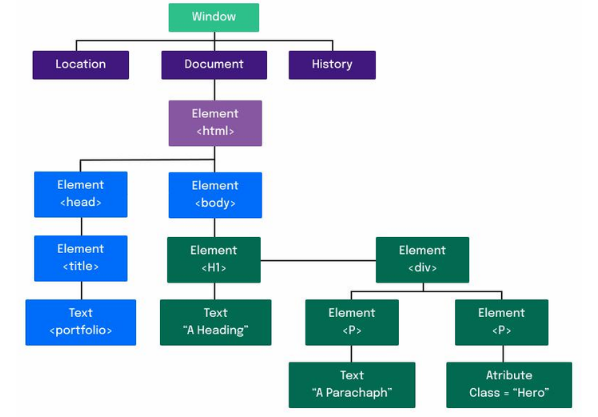

# JavaScript - DOM e Seletores - Para fixar:
----------
----------
### Estrutura DOM

 

Nessa imagem temos um exemplo de estrutura do DOM , ou melhor, da árvore do DOM , suas marcações e como ela é montada pelo browser. Vejamos um pouco mais sobre os objetos que a imagem apresenta:

* Window : Representa uma janela que contém um elemento DOM, sendo possível acessar o documento que a janela contém através de Window ;
* location : Representa a localização do objeto a qual ele está associado, isso é, o documento atual;
* document : Representa qualquer página da web carregada no navegador e serve como um ponto de entrada para o conteúdo na página da web, sendo assim o document contém todos os documentos HTML ;
* history : Permite a manipulação do histórico da sessão do navegador, ou seja, as páginas visitadas na guia ou quadro em que a página atual está carregada;
* element : É a classe base mais geral da qual todos os objetos em um Document herdam, isso é, são todas as tags que estão em arquivos HTML e se transformam em elementos da árvore DOM ;
* text : Texto que vai entre os elementos, é todo o conteúdo das tags;
* atribute : São todos os atributos que um nó específico possui, como uma class ou id .

----------
### Parte II - Seletores de elementos (arquivos exemplosParteII.html e exemplosParteII.js):
#### Exemplo 01:
Para começar a praticar, copie para um arquivo em sua máquina o exemplo abaixo.

~~~html
<!DOCTYPE html>
<html>
  <body>
    <header>
      <h2 id="page-title">Título</h2>
      
Dê uma cor para este parágrafo!

      <h4 id="subtitle">Subtítulo</h4>
      
Segundo parágrafo!

    </header>
    
  </body>
</html>
~~~

Agora faça o seguinte:

    1. Recupere o elemento que contém o título da página e faça algo com ele, como alterá-lo para o nome do seu filme favorito.
    2. Agora recupere o segundo parágrafo e use sua criatividade para alterá-lo.
    3. Por fim, recupere o subtítulo e altere-o também.
----------
#### Exemplo 02:
Utilizando o mesmo template de exercício anterior:

    4. Adicione uma classe igual para os dois parágrafos.
    5. Recupere os seus parágrafos via código JavaScript , usando a função getElementsByClassName ;
    6. Altere algum estilo do primeiro deles.
    7. Recupere o subtítulo e altere a cor dele usando a função getElementsByTagName .

----------
----------
### Parte III - Qual seletor usar? (arquivos exemplosParteIII.html e exemplosParteIII.js)
#### Exemplo 03:
Para praticar, substitua todas as funções que você usou no exercício anterior por querySelector e/ou querySelectorAll .

