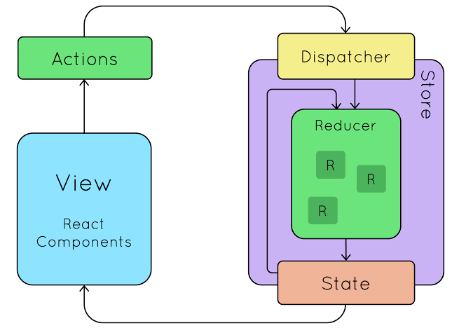

# Bloco 15: Gerenciamento de estado com Redux
## Dia 01: Introdução ao Redux - O estado global da aplicação
### Conteúdos abordados:

* Peças do Redux

* Entendendo actions, stores e reducers

 

* Combinando Reducers
