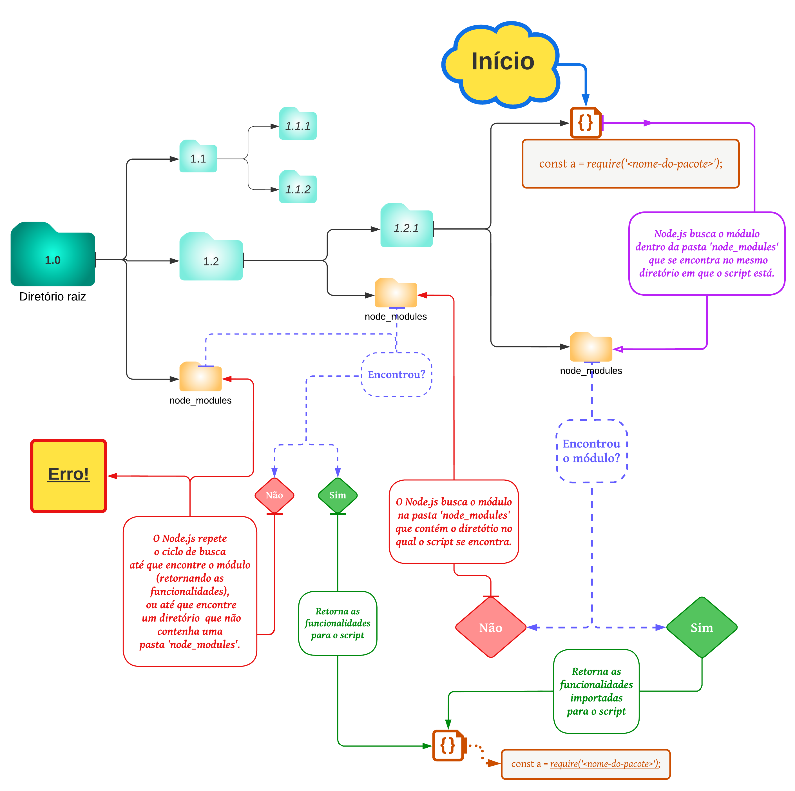

# Bloco 22: Introdução ao desenvolvimento Web com Node.js
## Dia 01: Intro - Node.js e Node.js - Um motor JavaScript

### Anotações de estudos:

#### Sistema de módulos:
* Funcionalidade ou conjunto de funcionalidades isoladas do restante do código;
* **Tipos de módulos**:
  * `Módulos internos` *(ou `core modules`)*:
    * São inclusos no Node.js e instalados junto com ele quando baixamos o runtime. Alguns exemplos:
      * `fs`: fornece uma API para interagir com o sistema de arquivos de forma geral;
      * `url`: provê utilitários para ler e manipular URLs;
      * `querystring`: disponibiliza ferramentas para leitura e manipulação de parâmetros de URLs;
      * `util`: oferece ferramentas e funcionalidades comumente úteis a pessoas programadoras.
      * `os`: oferece ferramentas e funcionalidades relacionadas ao sistema operacional.

  * `Módulos locais`:
    * São definidos juntamente à nossa aplicação e representam funcionalidades ou partes do nosso programa que foram separados em arquivos diferentes.
    * Eles podem ser publicados no `NPM` para utilizarmos em diversas aplicações diferentes, ou para que outras pessoas possam baixá-los e utilizá-los.

  * `Módulos de terceiros`:
    * São aqueles criados por outras pessoas e disponibilizados para uso através do npm.

* **Maneiras de importar e exportar módulos**:
  * **`ECMAScript 6`** - **`ES6`**:
      * Palavras-chave: `import` e `export`;
      * O Node.js não possui suporte a módulos ES6 por padrão, sendo necessário o uso de *transpiladores* ou de *supersets* para que esse recurso esteja disponível;

        > `Transpiladores`: *ferramentas que leem o código-fonte escrito em uma linguagem (como o Node.js) e produzem o código equivalente em outra. Exemplo: Babel;*

        > `Supersets`: *são linguagens que utilizam um transpilador para adicionar novas funcionalidades ao JavaScript. Exemplo: TypeScript;*

  * **`CommonJS`**:
    * Sistema de módulos implementado pelo Node.js nativamente;

-----

#### Exportando módulos:

* *`module.exports`:*
  * Recebe o valor a ser exportado, tornando-o acessível para importação em outros arquivos;
  * Pode receber qualquer valor válido em JavaScript (objetos, classes, funções, etc.).

-----

#### Importando módulos:

* **Módulos locais**:
  * *`require`:*
    * Recebe o caminho e o nome do arquivo onde o módulo se encontra;
      ~~~javascript
      require(./caminho-para-arquivo/nome-do-arquivo);
      ~~~

      > Não é necessário colocar a extensão do arquivo no require: o Node procura por arquivos terminados em `.js` ou `.json` e os considera como módulos.

    * Também pode importar uma pasta:
      * Útil quando um módulo está dividido em diversos arquivos e desejamos importar todas as suas funcionalidades;
      * Nesse caso, a pasta precisa conter um arquivo chamado `index.js`, que importa todos arquivos do módulo e os exporta da forma mais conveniente.

* **Módulos internos**:
  * *`require`:*
    * Recebe o nome do pacote como parâmetro;
      ~~~javascript
      const fs = require('fs');
      ~~~

      > Importa o pacote fs, responsável pelo sistema de arquivos.

* **Módulos de terceiros**:
  * Utilizados da mesma forma que os módulos internos, mas como não são nativos do Node.js, é necessário instalá-los na pasta do projeto em que serão utilizados:
    * *Quando importamos um módulo que não é nativo do Node.js e que não aponta para um arquivo local, o Node inicia uma busca por esse módulo na pasta `node_modules` de mesmo nível. Caso não seja encontrado ali, o node busca o módulo na pasta `node_modules` na pasta que contém a pasta atual. Esse processo se repete até que o Node encontre o módulo desejado ou até que uma pasta `node_modules` não exista no local em que o node esteja procurando.*

-----

#### Node Package Manager (NPM):

* Repositório oficial para publicação de pacotes Node.js.

* **Command Line Client (CLI) npm:**
  * Ferramenta oficial para gerenciamento de pacotes Node.js, sejam eles dependências da nossa aplicação ou nossos próprios pacotes.

* **Principais Comandos CLI:**
  * Criar novo pacote Node.js:
    * Cria o arquivo `package.json` *personalizado*:
      ~~~shell
      $ npm init
      ~~~

    * Cria o arquivo `package.json` *padrão*:
      ~~~shell
      $ npm init -y
      ~~~

  * Instalar pacotes no Node.js:
    * Instala *todas* as depedências do arquivo `package.json`:
      ~~~shell
      $ npm install
      ~~~

    * Instala o *pacote desejado* nas *depedências do arquivo* `package.json`:
      ~~~shell
      $ npm install <package_name>
      ~~~

    * Instala o *pacote desejado* nas *depedências de desenvolvimento* do arquivo `package.json`:
      ~~~shell
      $ npm install <package-name> --save-dev
      ~~~
      OU
      ~~~shell
      $ npm install <package-name> -D
      ~~~

  * Remover pacotes no Node.js:
    * Remove o *pacote desejado* das *depedências do arquivo* `package.json`:
      ~~~shell
      $ npm rm <package_name>
      ~~~

* **Criar scripts no arquivo `package.json`:**
  * Para iniciar a *aplicação principal*:
    ~~~json
    {
      "scripts": {
        "start": "node nome_do_seu_arquivo.js",
        // Exemplo:
        "start": "node index.js"
      }
    }
    ~~~

  * Cria *script personalizado* para o pacote desejado:
    ~~~json
    {
      "scripts": {
        "nome_do_comando_do_script": "o_que_deseja_executar",
        // Exemplo:
        "lint": "eslint ."
      }
    }
    ~~~

* **Comandos CLI para executar scripts do arquivo `package.json`:**

  * Executa a *aplicação principal* do pacote que esta criando:
    ~~~shell
    $ npm start
    ~~~

  * Executa o *script registrado* no arquivo `package.json`:
    ~~~shell
    $ npm run <package-name>
    ~~~
